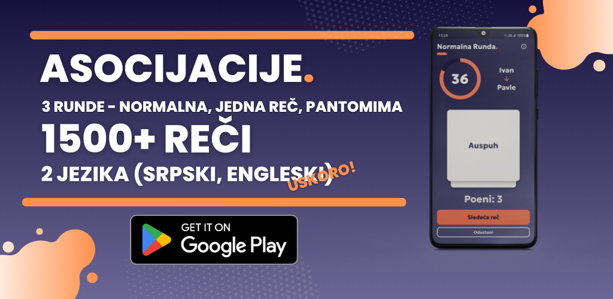

# Asocijacije.

Popularna društvena igra, ali sa 3 vrste rundi - Normalna, Jedna reč i Pantomima.

Igra se u timovima od po dvoje ljudi. Originalno se igra na papirićima gde svaki igrač piše određeni broj pojmova. Pojmovi se stavljaju u zajednički koš, izvlače i objašnjavaju. U aplikaciji se po igraču dobija 8 nasumičmnih pojmova.

## Runde
### Normalna runda 1️⃣
Traje 45 sekundi i treba rečima objasniti pojam bez korišćenja te reči ili korena iste.

### Jedna reč runda 2️⃣
Traje 45 sekundi i treba jednom rečju objasniti pojmove iz prethodne runde.

### Pantomima runda 3️⃣
Traje 60 sekundi i treba pantomimom objasniti pojmove iz prethodnih rundi.

Na kraju svih rundi, tim sa najviše objašnjenih pojmova je pobedio.

Runda traje dok se ne objasne svi pojmovi, tek nakon toga se prelazi u novu rundu.
